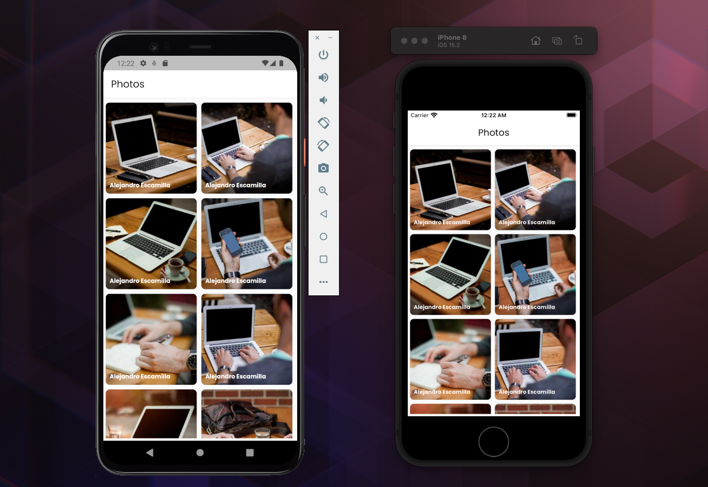

# Gallery

This app uses repository pattern for implementing a rest API.

## App Demo

<p align="center"></p>

## File Pattern Inside The `lib` Folder

```
    lib
    ├── app
    │   ├── core
    │   │   ├── repository
    │   │   │   └── photo_list_repo.dart
    │   │   ├── resource
    │   │   │   ├── string_resource.dart
    │   │   │   ├── theme.dart
    │   │   │   └── urls.dart
    │   │   └── utils
    │   │       ├── failure
    │   │       │   └── app_error.dart
    │   │       ├── api_client.dart
    │   │       ├── download_helper.dart
    │   │       ├── share_helper.dart
    │   │       └── wallpaper_set_helper.dart
    │   ├── model
    │   │   └── photo_list_model.dart
    │   ├── view
    │   │   ├── photo_full_screen.dart
    │   │   └── photo_list_screen.dart
    │   ├── view_model
    │   │   └── photo_list_view_model.dart
    │   └── widget
    │       └── photo_list_card.dart
    └── main.dart
```